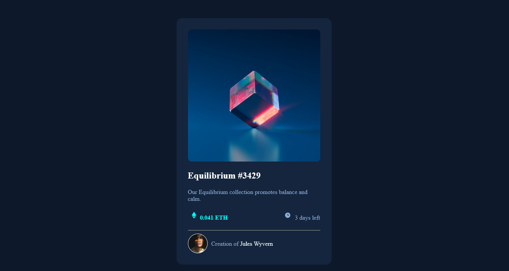

# BLOCKCHAIN UNN - NFT preview card component solution

This is a solution to the NFT preview card component challenge for BUD session 4

## Overview

### The challenge

Users should be able to:

- View the optimal layout depending on their device's screen size

### Screenshot

### Links

- Solution URL: [Add solution URL here](https://your-solution-url.com)
- Live Site URL: [Add live site URL here](https://your-live-site-url.com)

## My process
I coded the write ups into HTML & styled it with CSS lastly.
I used BRACKETS code editor to do this task.

### Built with

- Semantic HTML5 markup
- CSS custom properties
- Flexbox
- CSS Grid
- Mobile-first workflow

### What I learned
I learnt how to use flex for the first time(display: Flex). I encountered some difficulties when apply it at the for class= card-details, it is not reflexing, I redo it and gave it new class, it starts working.
I learnt also how align-item works.

If you want more help with writing markdown, we'd recommend checking out [The Markdown Guide](https://www.markdownguide.org/) to learn more.

**Note: Delete this note and the content within this section and replace with your own learnings.**

## Acknowledgments

Thank you BLOCKCHAIN UNN for this opportunity. 
